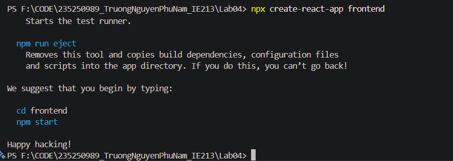
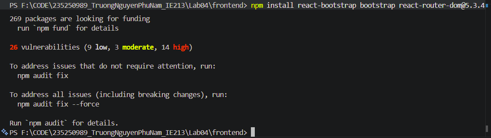
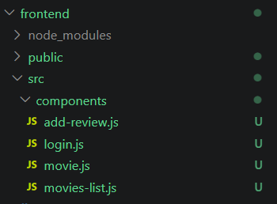
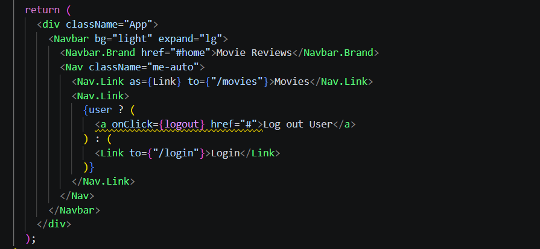
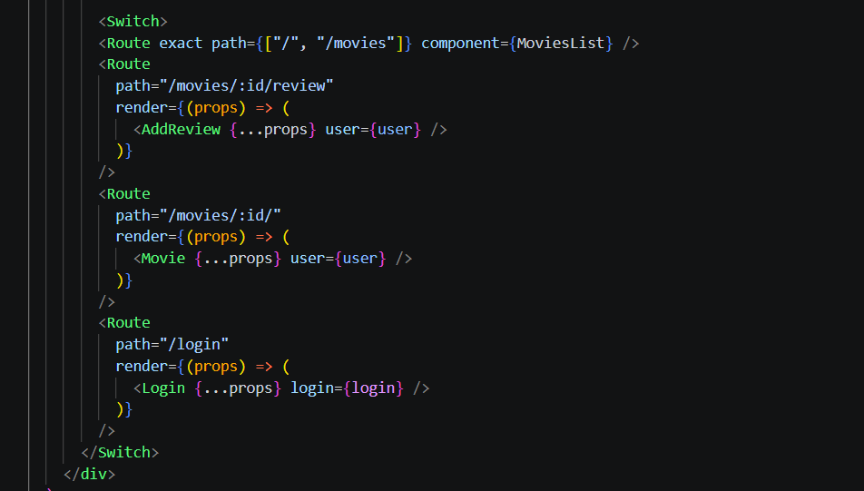
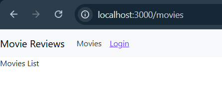
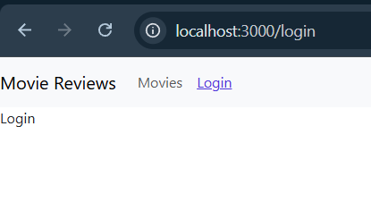

# Bài thực hành 4  
## THIẾT LẬP FRONTEND VỚI REACTJS

---

## Bài 1: Thiết lập nơi làm việc với frontend của dự án

### 1.1 Tạo template frontend với React

### 1.2 Cài đặt các package hỗ trợ

---

## Bài 2: Xây dựng Navigation Header Bar

### 2.1 Khởi tạo các Component cơ bản

### 2.2 Thiết lập Navbar components

### 2.3 Điều chỉnh thông tin
- Cập nhật nội dung hiển thị trên navbar  
- Thiết lập điều hướng giữa các trang  

---

## Bài 3: Thiết lập các định tuyến (Routing)

### 3.1 Định tuyến các component đã tạo
- `/movies`
- `/movies/:id`
- `/movies/:id/review`
- `/login`

### 3.2 Cấu hình định tuyến trong `App.js`

---

## Kết quả chạy thử

