# BÀI THỰC HÀNH 5: XÂY DỰNG FRONTEND VỚI REACTJS 

---

## Bài 1: Kết nối tới Backend

### 1.1. Cài đặt Axios
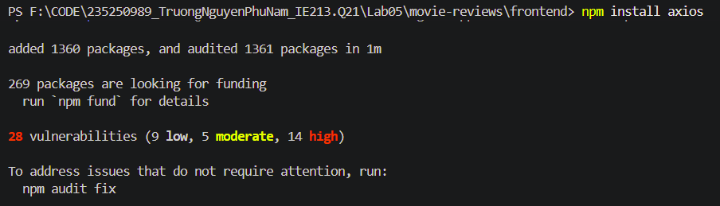

### 1.2 & 1.3. Tạo lớp dịch vụ MovieDataService
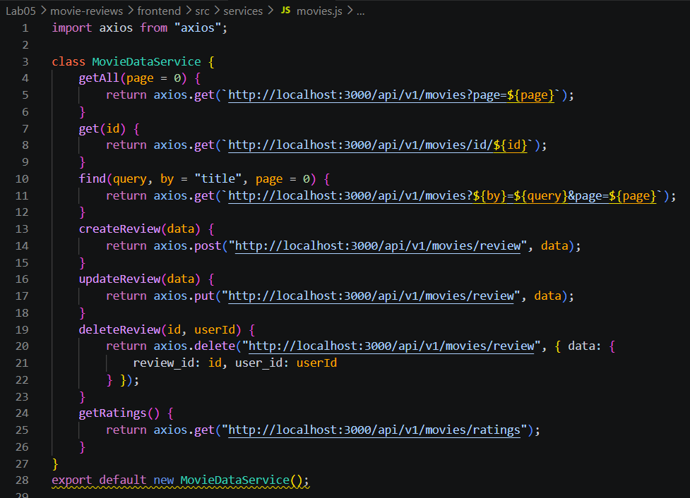

---

## Bài 2: Xây dựng Movies List Component

*Mục tiêu: Hoàn thiện màn hình Danh sách phim.*

**Lưu ý:** Cần cài đặt và sử dụng thư viện `react-bootstrap`.
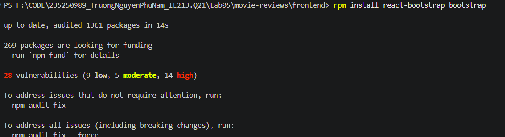

### 2.1. Tạo các biến trạng thái
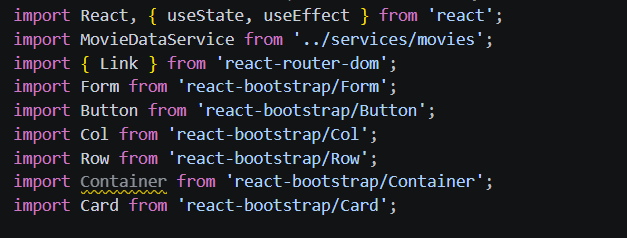

### 2.2. Tạo phương thức `retrieveMovies()` và `retrieveRatings()` & dùng `useEffect()`
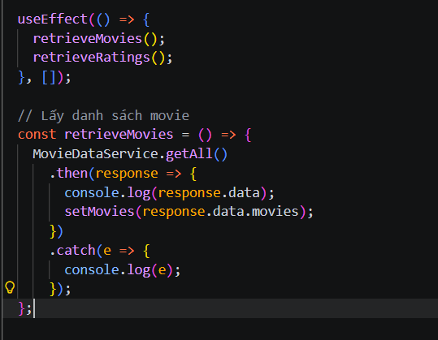

### 2.3 & 2.4. Tạo 2 search form và hiển thị các movie bằng `<Card>`
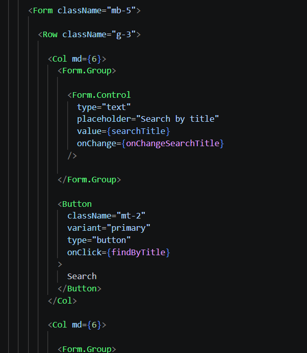
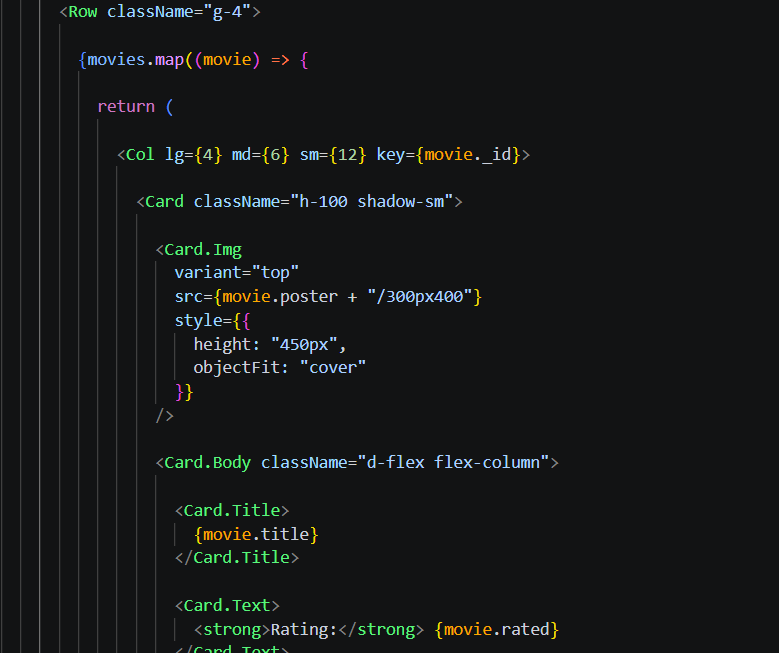

### 2.5. Hiện thực 2 phương thức `findByTitle()` và `findByRating()`
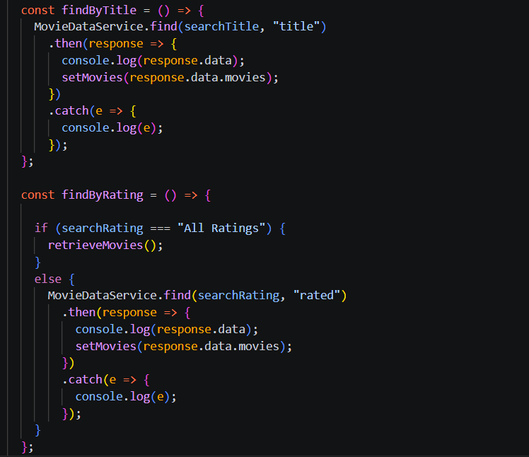

---

## Bài 3: Hiển thị thông tin trang Movie khi nhấn vào ‘View Reviews’

### 3.1. Thiết lập mã nguồn cho component Movie
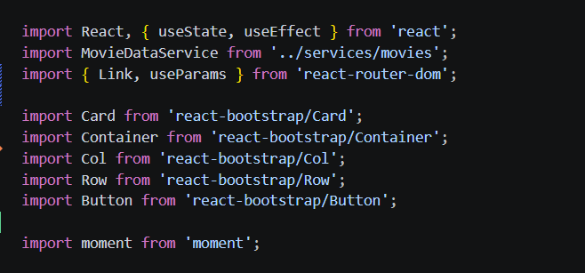

### 3.2. Xây dựng mã nguồn cho phương thức `getMovie()`
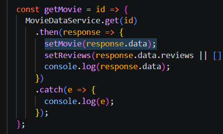

### 3.3. Trang trí phần JSX trả về
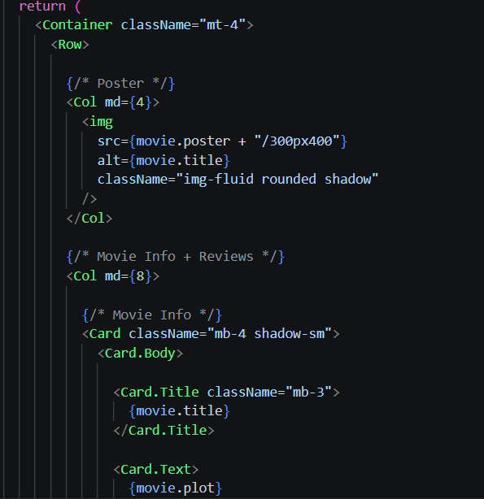

---

## Bài 4: Hiển thị danh sách review tương ứng cho từng phim dưới phần Plot

**Cài đặt thư viện `moment` để xử lý thời gian:**
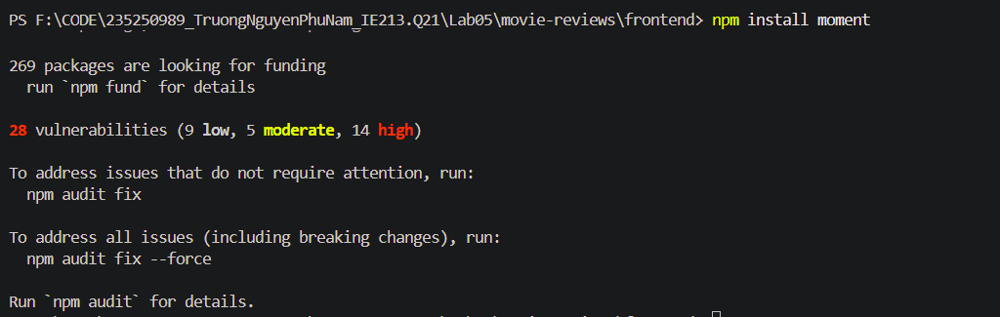

### 4.1. Viết đoạn mã nguồn JSX cho phép hiển thị danh sách review
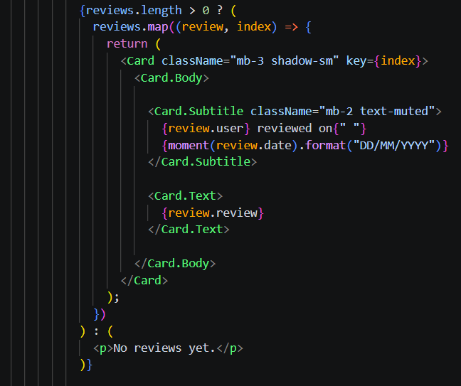

### 4.2. Điều chỉnh lại cách hiển thị giờ với `momentjs`
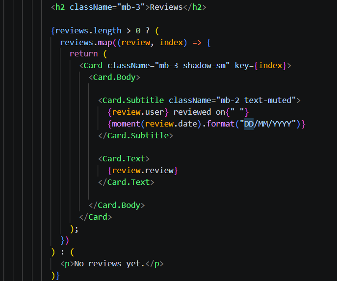

---

## 🌟 Kết quả chạy thử

Dưới đây là kết quả giao diện hiển thị trên trình duyệt sau khi hoàn thiện:

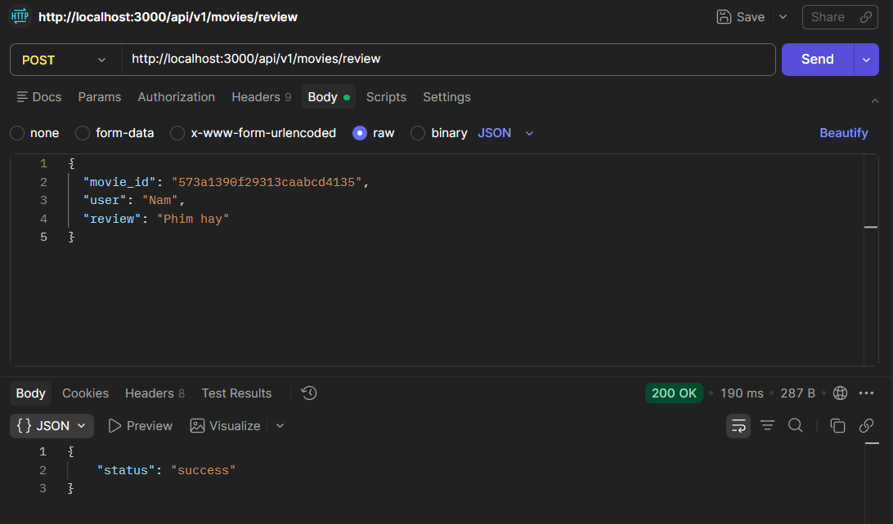
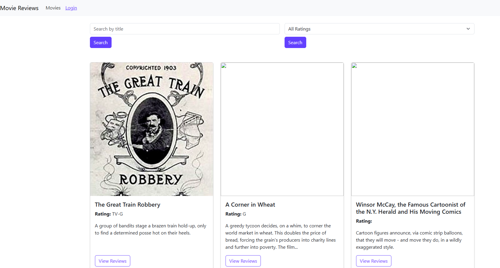
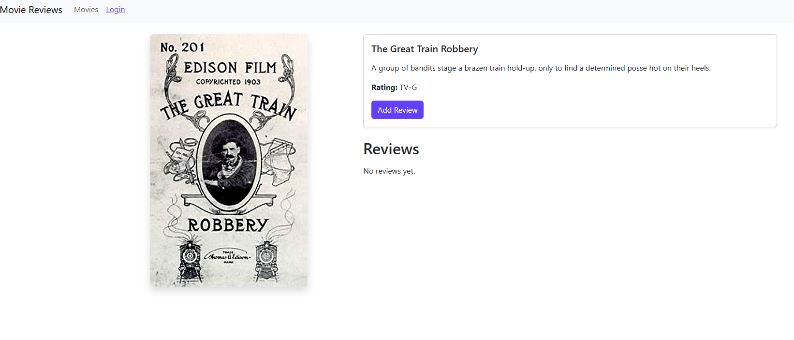