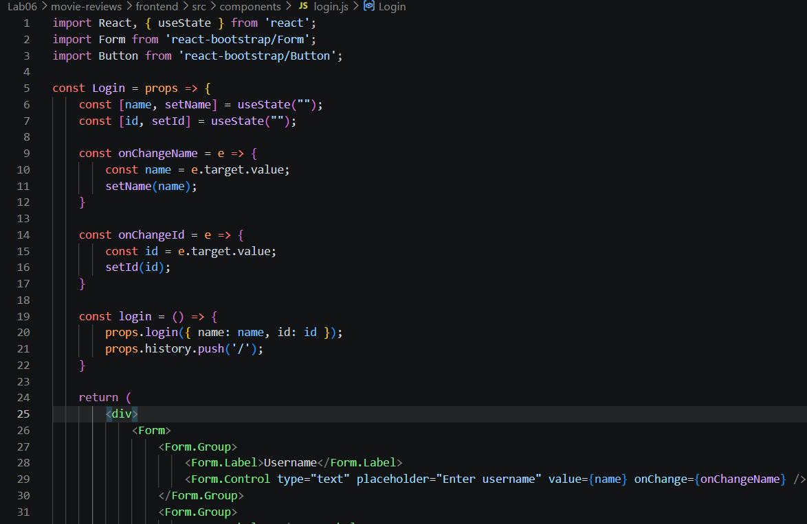
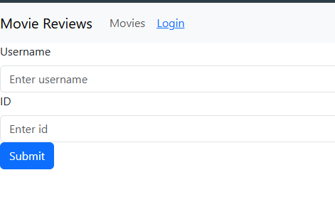
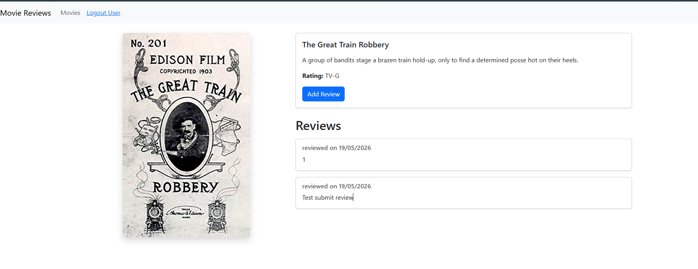
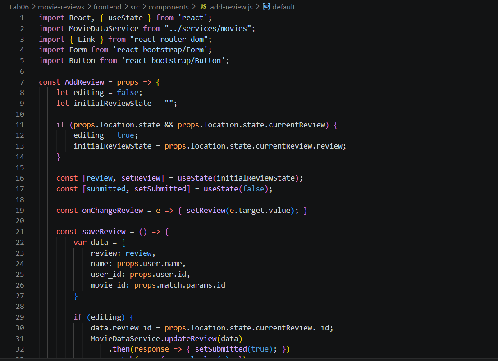
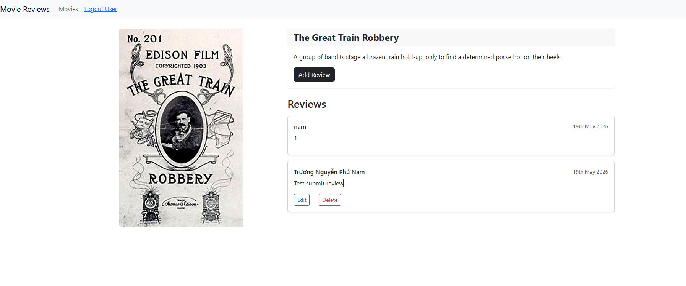
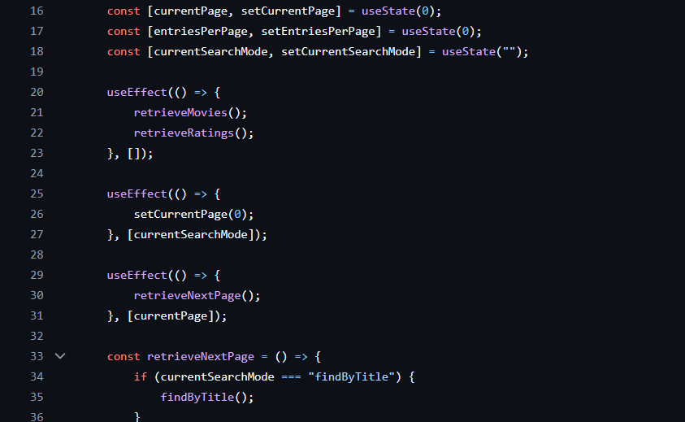

# BÀI THỰC HÀNH 6  
# XÂY DỰNG FRONTEND VỚI REACTJS

# 1. Xây dựng chức năng Login

## 1.1 Tạo Login Component

Thực hiện xây dựng component đăng nhập cho người dùng bằng ReactJS.

### 📷 Giao diện Login

---

# 2. Xây dựng tính năng Review

## 2.1 Thêm và sửa Review

Cho phép người dùng:

- Thêm review mới
- Chỉnh sửa review đã tạo
- Hiển thị nội dung review theo từng phim

### 📷 Giao diện thêm / sửa Review

---

## 2.2 Kết quả sau khi chạy thử

Sau khi hoàn thành chức năng review:

- Dữ liệu được lưu thành công
- Review hiển thị trực tiếp trên giao diện

### 📷 Kết quả thực tế

---

# 3. Xóa Review

## 3.1 Thêm phương thức xóa Review

Thực hiện bổ sung phương thức `deleteReview()` vào component `Movie`.

### Chức năng:

- Xóa review theo ID
- Cập nhật lại state sau khi xóa
- Render lại danh sách review

### 📷 Source code xóa Review

---

## 3.2 Kết quả sau khi chạy thử

Sau khi thực hiện xóa:

- Review bị xóa khỏi database
- Giao diện cập nhật ngay lập tức

### 📷 Kết quả

---

# 4. Lấy dữ liệu cho trang tiếp theo

## 4.1 Gọi API lấy dữ liệu

Frontend sử dụng API để lấy dữ liệu phim và review từ backend.

### 📷 Source code API

