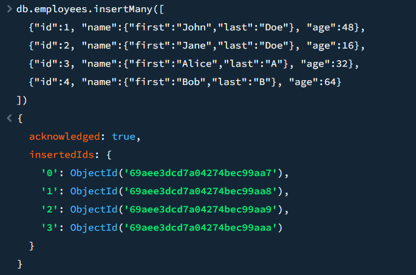
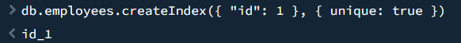
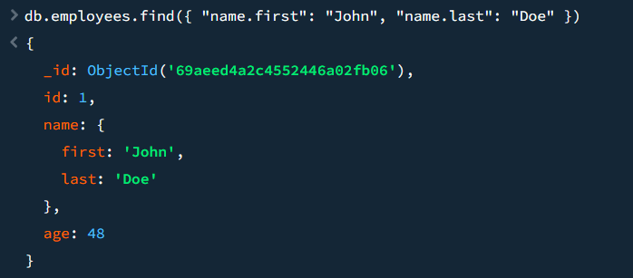
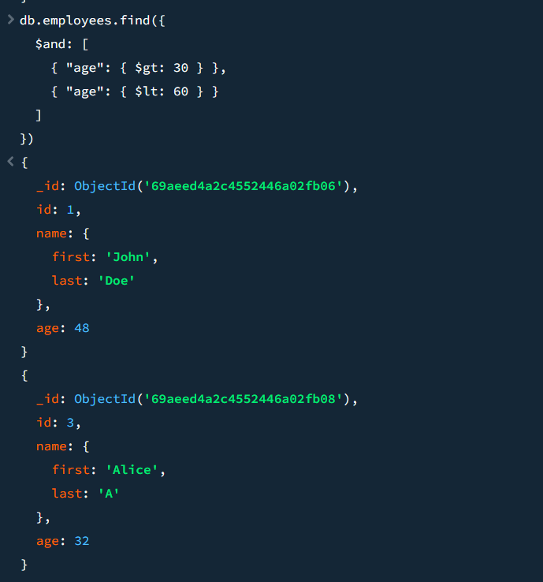
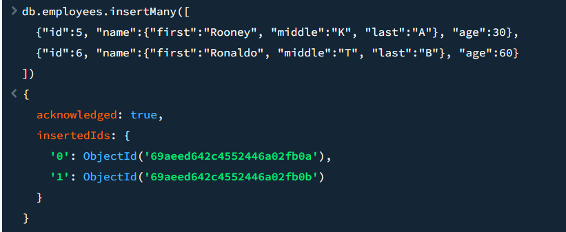
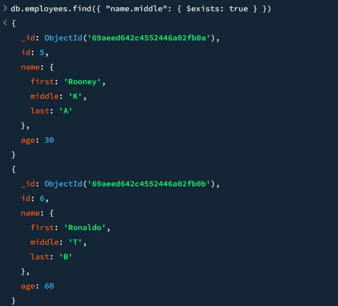
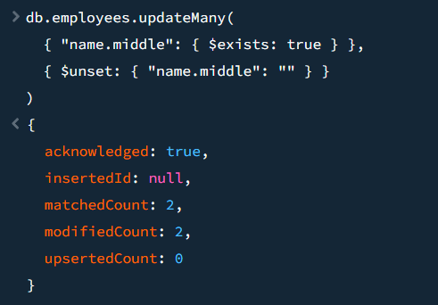
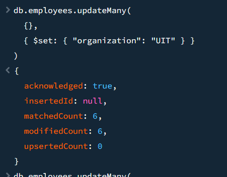
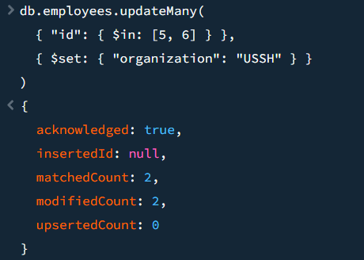
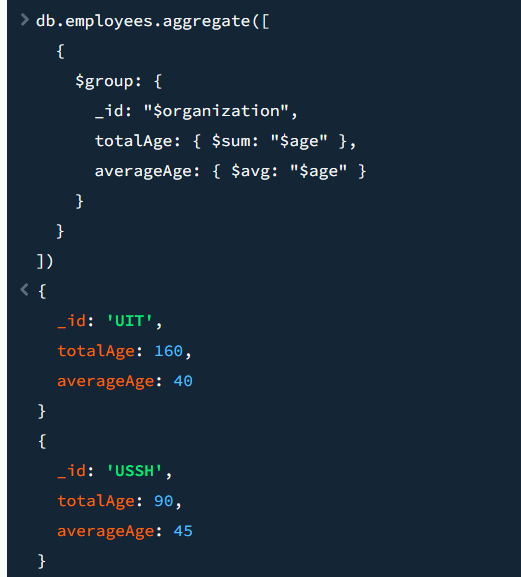

2.1  
 
use 23520989-ie213  
  
 
---
2.2  
 
db.employees.insertMany([ 
  {"id":1, "name":{"first":"John","last":"Doe"}, "age":48}, 
  {"id":2, "name":{"first":"Jane","last":"Doe"}, "age":16}, 
  {"id":3, "name":{"first":"Alice","last":"A"}, "age":32}, 
  {"id":4, "name":{"first":"Bob","last":"B"}, "age":64} 
]) 
  
 
---
2.3 
 
db.employees.createIndex({ "id": 1 }, { unique: true })  
 
 
---
2.4 
 
db.employees.find({ "name.first": "John", "name.last": "Doe" }) 
 
 
---
2.5 
 
db.employees.find({ 
  $and: [ 
    { "age": { $gt: 30 } }, 
    { "age": { $lt: 60 } } 
  ] 
}) 
 
 
---
2.6 
 
db.employees.insertMany([ 
  {"id":5, "name":{"first":"Rooney", "middle":"K", "last":"A"}, "age":30}, 
  {"id":6, "name":{"first":"Ronaldo", "middle":"T", "last":"B"}, "age":60} 
]) 
 
 
db.employees.find({ "name.middle": { $exists: true } }) 
 
 
---
2.7 
 
db.employees.updateMany( 
  { "name.middle": { $exists: true } }, 
  { $unset: { "name.middle": "" } } 
) 
 
 
---
2.8 
 
db.employees.updateMany( 
  {},  
  { $set: { "organization": "UIT" } } 
) 
 
 
---
2.9 
 
db.employees.updateMany( 
  { "id": { $in: [5, 6] } }, 
  { $set: { "organization": "USSH" } } 
) 
 
 
---
2.10 
 
db.employees.aggregate([ 
  { 
    $group: { 
      _id: "$organization", 
      totalAge: { $sum: "$age" }, 
      averageAge: { $avg: "$age" } 
    } 
  } 
]) 
 
 
---