# BÀI THỰC HÀNH 2: THIẾT LẬP BACKEND VỚI NODEJS | EXPRESSJS 

**Họ và tên:** Trương Nguyễn Phú Nam  
**Mã số sinh viên:** 23520989  

---

## Bài 1: Thiết lập môi trường

### 1.1 Tải và cài đặt Node.js
Tải Node.js tại trang chủ `nodejs.org`. (Kiểm tra cài đặt thành công với câu lệnh `node -v` trên giao diện dòng lệnh như terminal trên MacOS, Linux và cmd, powershell trên Windows).

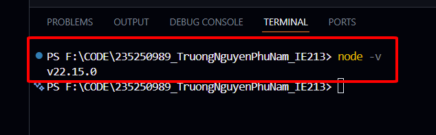

### 1.2 Tải và cài đặt công cụ soạn thảo và quản lý mã nguồn
Sử dụng phần mềm Visual Studio Code.

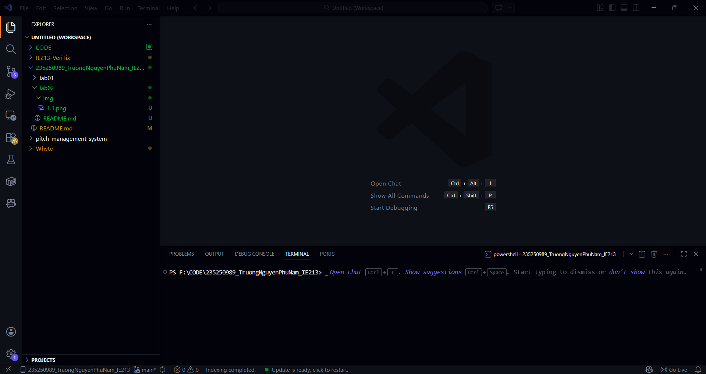

### 1.3 Khởi tạo cây thư mục chứa mã nguồn của dự án
Khởi tạo cấu trúc thư mục `movie-reviews/backend`.

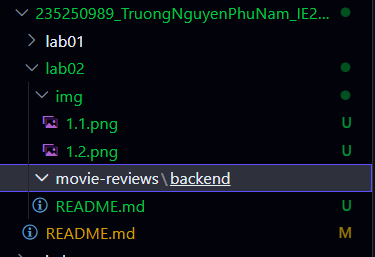

### 1.4 Khởi tạo dự án với câu lệnh npm init
Sử dụng lệnh `npm init -y` để khởi tạo nhanh file `package.json`.

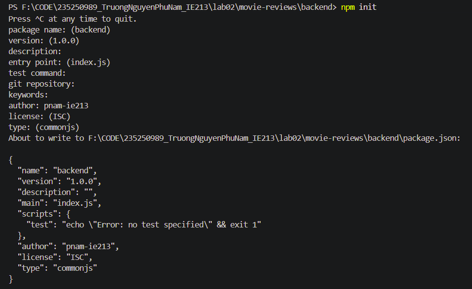

### 1.5 Cài đặt một số dependency của dự án
Cài đặt các thư viện cần thiết cho Backend: `mongodb`, `express`, `cors`, `dotenv`.

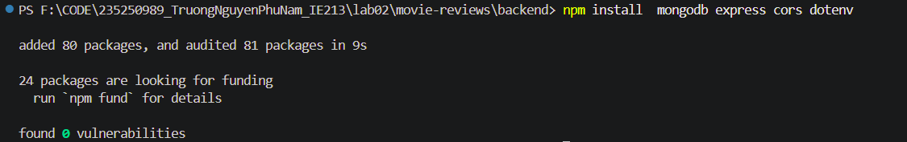  
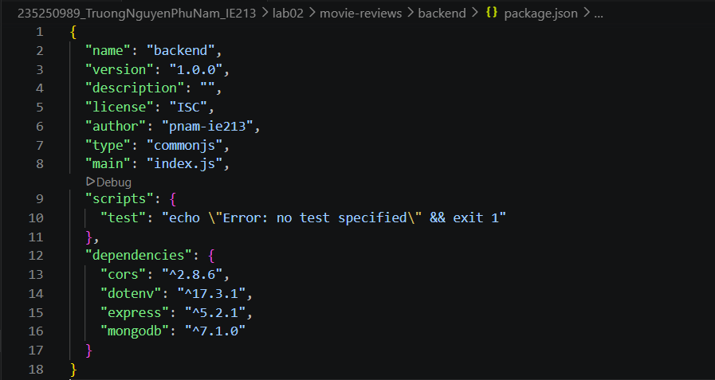

### 1.6 Cài đặt nodemon
Cài đặt `nodemon` (dưới dạng devDependencies) – công cụ giúp tự động khởi động lại máy chủ web khi có sự thay đổi về mã nguồn.

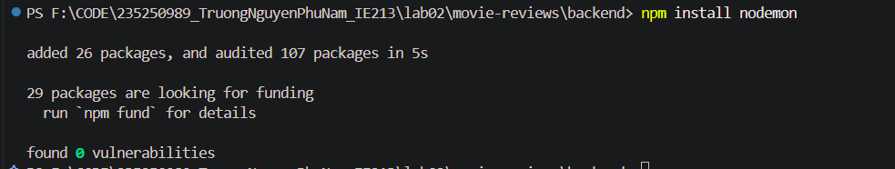  

---

## Bài 2: Thiết lập Backend

### 2.1 Tạo tệp tin server.js là nơi khởi tạo máy chủ web
(Tệp này nằm trong thư mục `backend`).
- Trong tệp tin này cần thêm các dependency như `express`, `cors` để sử dụng các phương thức (middleware) của chúng.
- Đồng thời, nội dung tệp tin này cũng chứa một số routing cơ bản cho máy chủ web, như xử lý lỗi `404 Not Found`, và định tuyến tới `/api/v1/movies`.

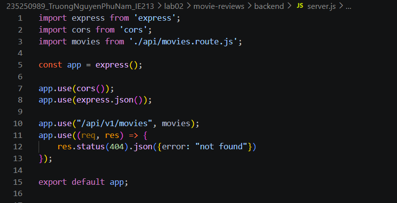

### 2.2 Tạo tệp tin .env
Tạo file `.env` để lưu trữ thông tin biến môi trường phát triển như URI kết nối tới Database trên MongoDB Atlas, PORT dịch vụ web (ví dụ: `3000` hoặc `5000`).

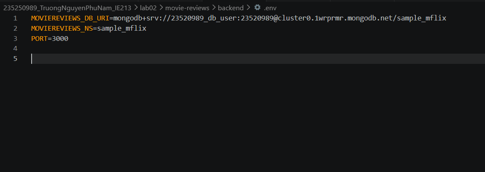

### 2.3 Tạo tệp tin index.js
Tệp tin gốc dùng để quản lý việc kết nối cơ sở dữ liệu, khởi tạo đối tượng, và chạy máy chủ lắng nghe các request.

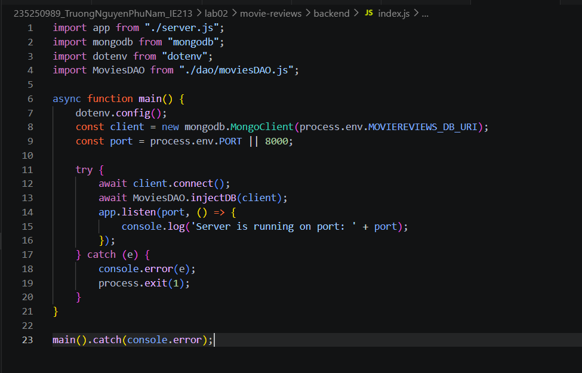

### 2.4 Tạo thư mục và tệp tin movies.route.js
Tạo thư mục tương ứng gồm `api/movies.route.js` để xử lý các định tuyến liên quan đến ứng dụng minh hoạ movies về sau.
- Trong nội dung này, để một định tuyến duy nhất `/` trả về cho máy khách thông báo `hello world`.
- Ví dụ máy khách truy cập: `localhost:3000/api/v1/movies` thì sẽ nhận được phản hồi `hello world`.

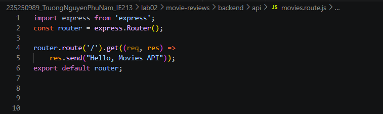

### 2.5 Thiết lập công cụ truy xuất dữ liệu với DAO (Data Access Object)
- Tạo thư mục `dao` trong thư mục backend, tạo tệp tin `moviesDAO.js` trong thư mục này.
- Tệp tin `moviesDAO.js` hiện tại sẽ bao gồm class `MoviesDAO` chứa 2 phương thức chính là:
  - `injectDB()`: dùng để thiết lập kết nối và tham chiếu tới collection `movies` trên database `sample_mflix`.
  - `getMovies()`: để query, lọc và trả về danh sách các movies cùng số lượng tương ứng thông qua tham số: `moviesList` và `totalNumMovies`.

  

Khởi tạo đối tượng của lớp `MoviesDAO` trong tệp tin `index.js` để sử dụng phương thức `injectDB()` ngay khi server khởi động.

### 2.6 Thiết lập Controller cho ứng dụng web để gọi tới DAO
Tạo tệp tin `movies.controller.js` trong thư mục `api` để thực hiện tác vụ trung gian, tiếp nhận yêu cầu từ máy khách thông qua API (endpoint), xử lý các query parameters, sau đó định tuyến (route) tới function trong DAO movies phù hợp.
- Trong class `MoviesController` tạo function `apiGetMovies()` trả về chuỗi JSON chứa dữ liệu phim để gửi về cho máy khách.

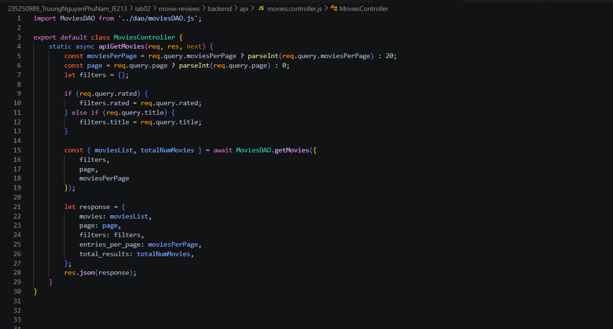

### 2.7 Đưa Controller vừa tạo vào định tuyến
Đưa Controller vừa tạo ở yêu cầu 2.6 vào file `movies.route.js`.
Ví dụ: Khi gửi một request `GET` tới `localhost:3000/api/v1/movies/`, máy chủ web sẽ gọi hàm `apiGetMovies` trong `MoviesController` để xử lý yêu cầu và trả về thông tin danh sách phim.

Cập nhật file route:

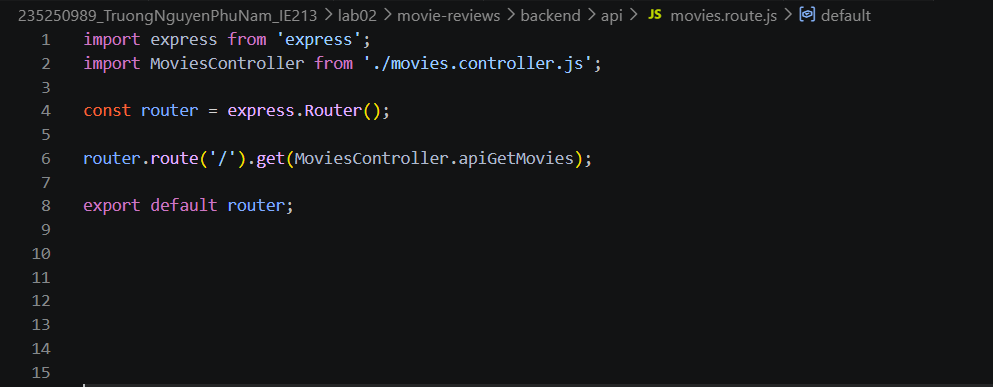

Kết quả test thành công trên ứng dụng Postman:

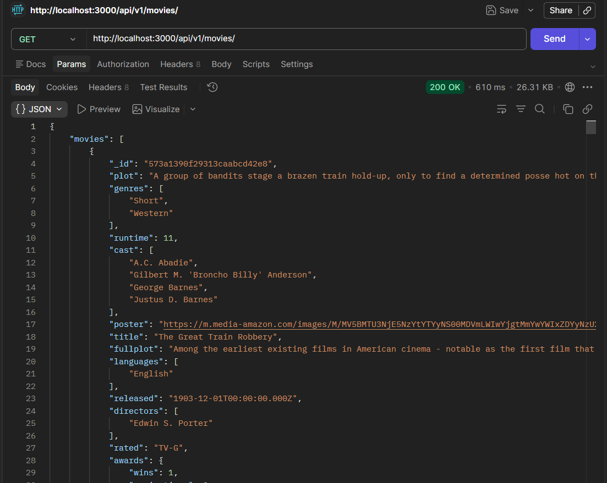

---

## 3. Kết luận

Qua bài thực hành này, em đã làm quen với việc thiết lập một backend cơ bản bằng **Node.js** và framework **ExpressJS**.  

Các phần chính em đã thực hiện và hiểu rõ bao gồm:
- Khởi tạo dự án Node.js và quản lý package bằng `npm`.
- Cài đặt và thiết lập các thư viện quan trọng: `express`, `cors`, `dotenv`, `mongodb`, `nodemon`.
- Ẩn thông tin bảo mật và cấu hình môi trường bằng file `.env`.
- Tổ chức thư mục code theo kiến trúc phân tầng chuẩn: **Route -> Controller -> DAO (Data Access Object)**.
- Kết nối thành công ứng dụng backend với cơ sở dữ liệu đám mây **MongoDB Atlas**.
- Tạo và kiểm thử API trả về dữ liệu định dạng JSON bằng công cụ **Postman**.
- Sử dụng công cụ AI để hỗ trợ tổng hợp và tạo file `README.md` báo cáo tự động, thẩm mỹ dựa trên format chuẩn.
