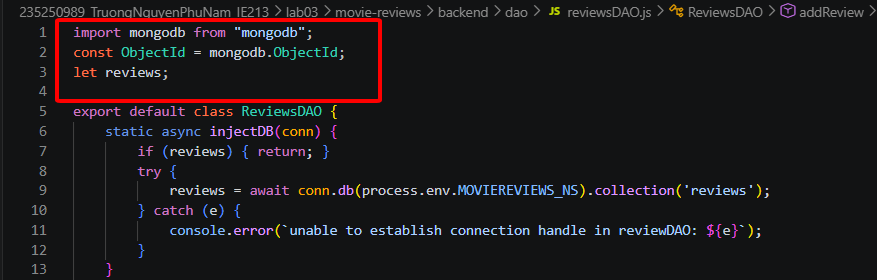
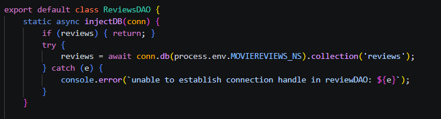
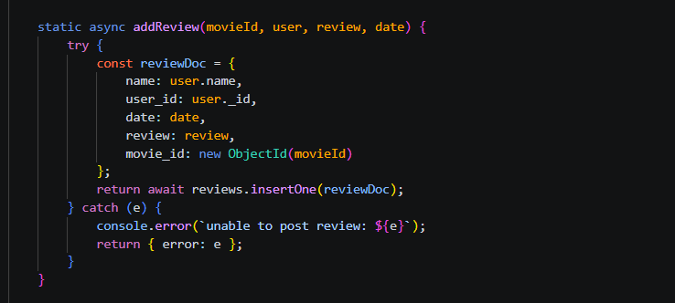
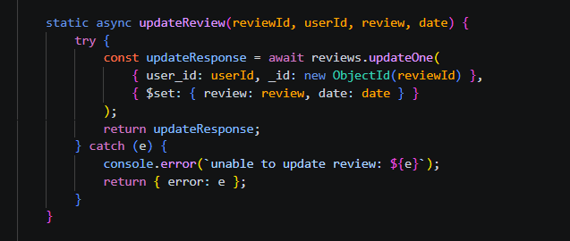
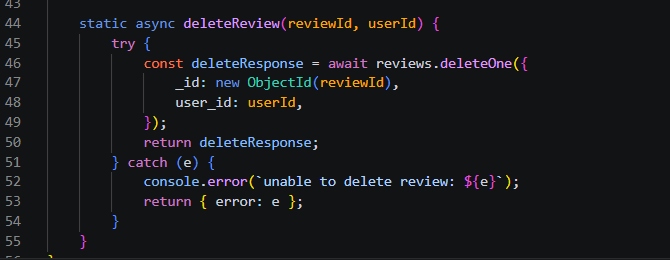

# Báo cáo Thực hành Lab 3
 

## Bài 1: Thiết lập định tuyến cho các thao tác với review
 

**1.1** Định tuyến này sẽ có đường dẫn cuối cùng là `/review`
 

**1.2** Thiết lập định tuyến thêm review (`POST`)
 

**1.3** Thiết lập định tuyến sửa review (`PUT`)
 

**1.4** Thiết lập định tuyến xoá review (`DELETE`)
 

  

---
 

## Bài 2: Thiết lập Controller cho review
 

**2.1** Tạo tệp tin `reviews.controller.js`
 

 

**2.2** Import `ReviewsDAO`
 

 

**2.3** Tạo phương thức `apiPostReview()`
 

 

**2.4** Tạo phương thức `apiUpdateReview()`
 

 

**2.5** Tạo phương thức `apiDeleteReview()`
 

  

---
 

## Bài 3: Thiết lập DAO cho reviews
 

**3.1** Khởi tạo `reviewsDAO.js`
 

 

**3.2** Tạo phương thức `injectDB()`
 

 

**3.3** Tạo phương thức `addReview()`
 

 

**3.4** Tạo phương thức `updateReview()`
 

 

**3.5** Tạo phương thức `deleteReview()`
 

 

**3.6** Thử nghiệm các API bằng Postman
 

 

 

  

---
 

## Bài 4: Hoàn thành back-end cho ứng dụng minh họa
 

**4.1** Thêm 2 định tuyến mới
 

 

**4.2** Cập nhật Controller cho Movie
 

 

**4.3** Cập nhật DAO cho Movie
 

 

**4.4** Thử nghiệm các API vừa tạo
 

 

 