# Báo cáo Thực hành Lab 3: Hoàn thiện Back-end cho Movie Reviews

## Bài 1: Thiết lập định tuyến cho các thao tác với review
Thiết lập các định tuyến cơ bản để xử lý các yêu cầu (request) liên quan đến đánh giá bộ phim.

* **1.1** Định tuyến này sẽ có đường dẫn cuối cùng là `/review`.
* **1.2** Thiết lập định tuyến thêm review (`POST`).
* **1.3** Thiết lập định tuyến sửa review (`PUT`).
* **1.4** Thiết lập định tuyến xoá review (`DELETE`).

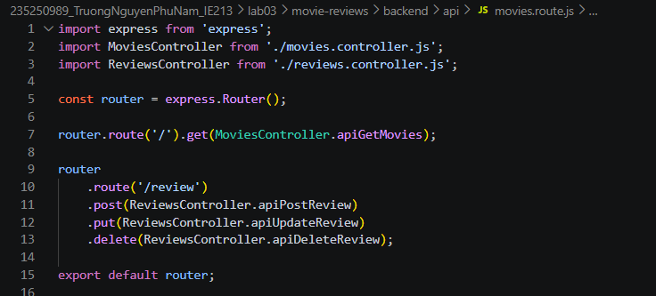

---

## Bài 2: Thiết lập Controller cho review
Xây dựng các phương thức trong Controller để tiếp nhận yêu cầu từ client và gọi đến DAO.

* **2.1** Tạo tệp tin `reviews.controller.js`
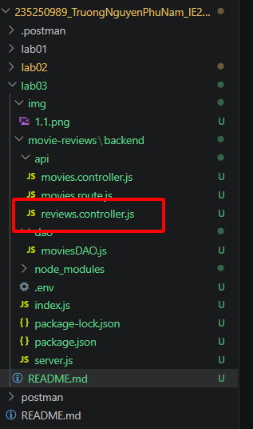

* **2.2** Import `ReviewsDAO`
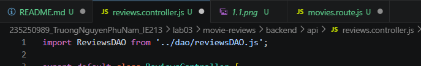

* **2.3** Tạo phương thức `apiPostReview()`
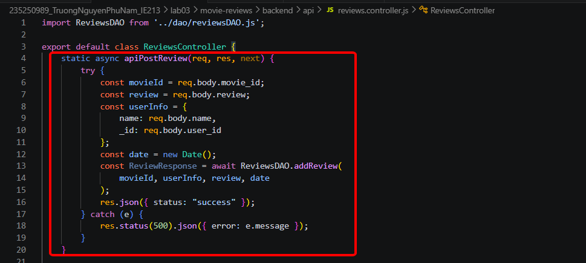

* **2.4** Tạo phương thức `apiUpdateReview()`
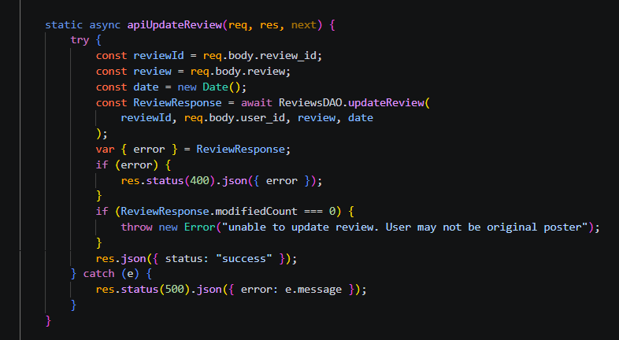

* **2.5** Tạo phương thức `apiDeleteReview()`
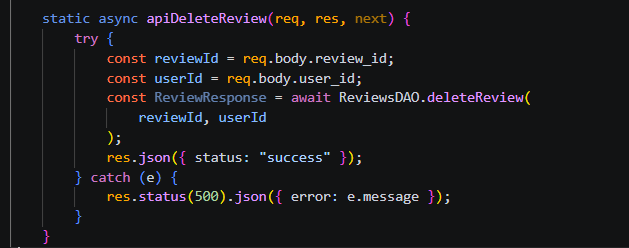

---

## Bài 3: Thiết lập DAO cho reviews
Xây dựng Data Access Object (DAO) để tương tác trực tiếp với cơ sở dữ liệu MongoDB.

* **3.1** Khởi tạo `reviewsDAO.js`
* **3.2** Tạo phương thức `injectDB()` để kết nối collection.
* **3.3** Tạo phương thức `addReview()` sử dụng `insertOne`.
* **3.4** Tạo phương thức `updateReview()` sử dụng `updateOne`.
* **3.5** Tạo phương thức `deleteReview()` sử dụng `deleteOne`.

* **3.6** Thử nghiệm các API bằng Postman:
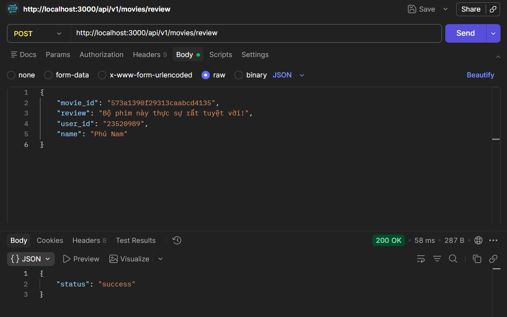
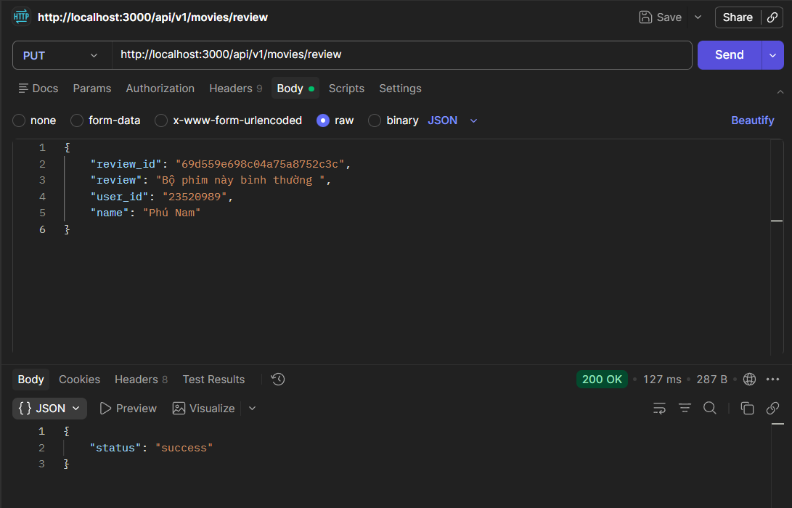
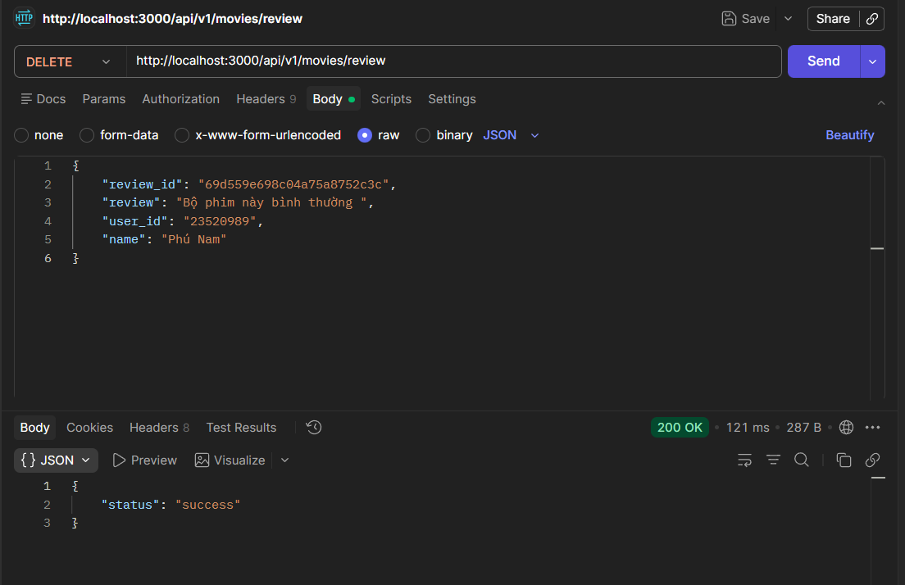

---

## Bài 4: Hoàn thành back-end cho ứng dụng minh họa
Tích hợp và mở rộng các tính năng lấy chi tiết phim và danh sách nhãn dán.

* **4.1** Thêm 2 định tuyến mới cho Movie
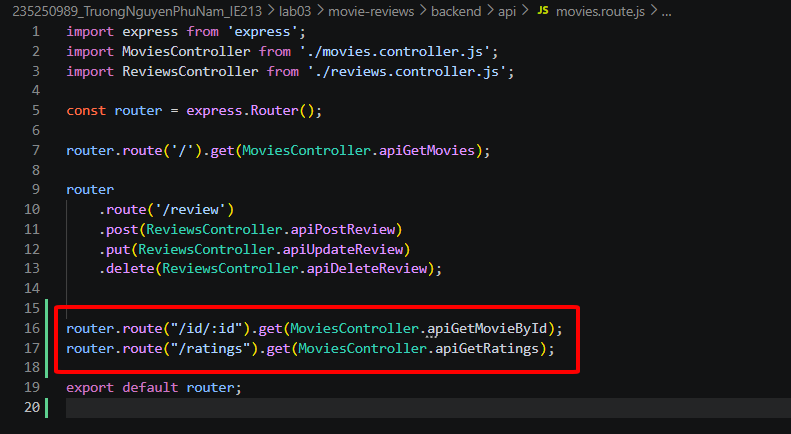

* **4.2** Cập nhật Controller cho Movie (`apiGetMovieById`, `apiGetRatings`)
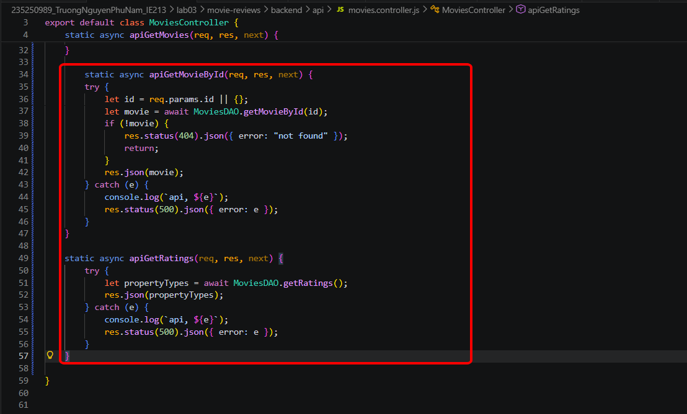

* **4.3** Cập nhật DAO cho Movie (`getMovieById`, `getRatings`)
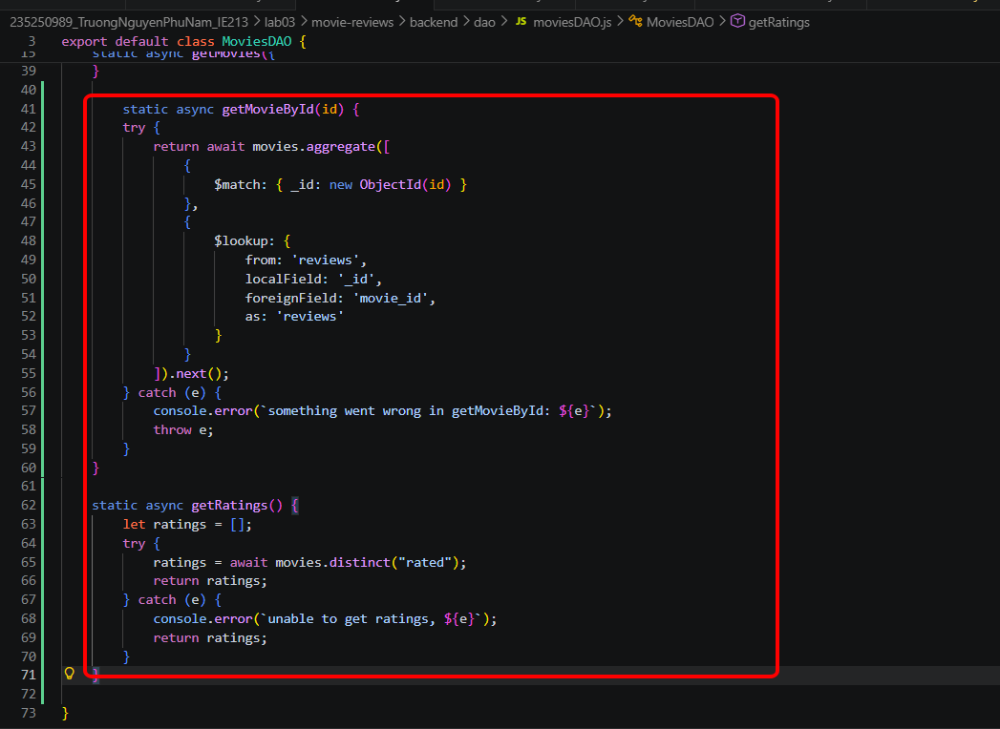

* **4.4** Thử nghiệm các API vừa tạo trên Postman:
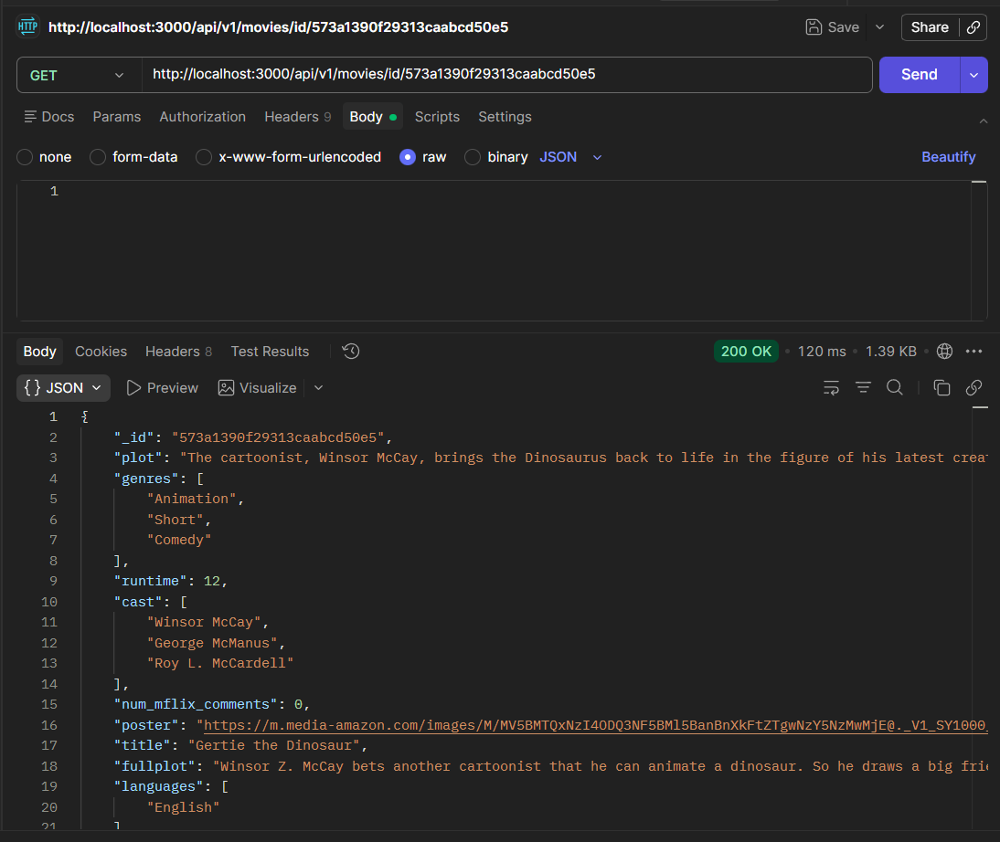
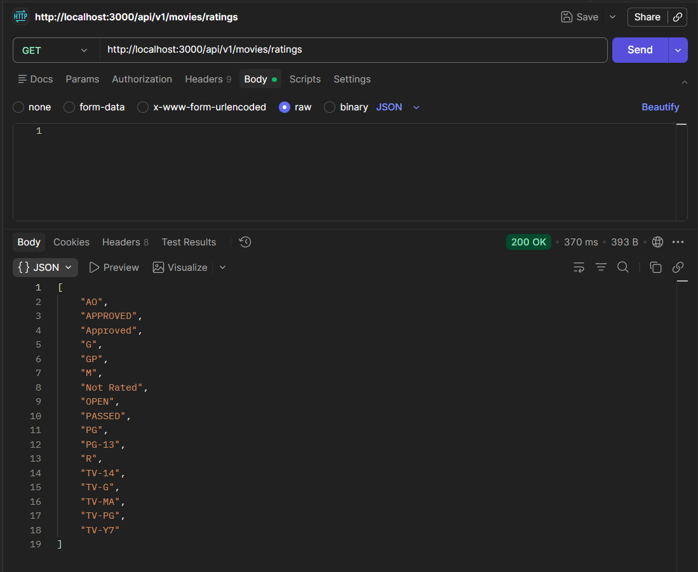